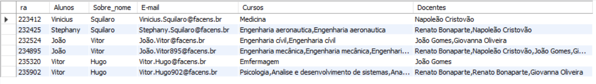

Crie um banco de dados para armazenar alunos, cursos e professores de uma
universidade;
Faça a modelagem do banco e identifique as entidades, seus atributos e relacionamentos
Crie o modelo físico do banco de dados (script SQL)


Utilize Stored Procedures para automatizar a inserção e seleção dos cursos;
O aluno possui um email que deve ter seu endereço gerado automaticamente no seguinte formato:
nome.sobrenome@dominio.com
Como fica o email se duas pessoas tiverem o mesmo nome e sobrenome?
``` sql
DELIMITER $
CREATE PROCEDURE inserir_alunos(
  ra int ,
  nome_aluno VARCHAR(100),
  sobre_nome_aluno VARCHAR(100)
)
BEGIN
  -- Declara 4 variáveis locais
  DECLARE nome_completo VARCHAR(200);
  declare parte_ra int;
  DECLARE contador INT;
  DECLARE email VARCHAR(100);
  -- Combina o nome e o sobrenome do aluno para formar o nome completo
  SET nome_completo = CONCAT(nome_aluno, '.', sobre_nome_aluno);
  -- Conta o número de alunos com o mesmo nome e sobrenome
  SET contador = (SELECT COUNT(*) FROM Alunos WHERE nome = nome_aluno AND sobre_nome = sobre_nome_aluno);
  -- Se o número de alunos for maior que 0, adiciona o número do RA ao nome completo para criar o email
  set parte_ra = substring(ra,4, 6);
  IF contador > 0 THEN
    SET email = CONCAT(nome_completo, parte_ra, '@facens.br'); 
  ELSE
    SET email = CONCAT(nome_completo, '@facens.br');
  END IF;
  -- Insere os dados do aluno na tabela `Alunos`
  INSERT INTO Alunos (id,ra, nome, sobre_nome, email) VALUES (0,ra, nome_aluno, sobre_nome_aluno, email);
END$
DELIMITER ;
```


### Resultado:


### Mostrar alunos e cursos que frequentam
```sql
-- cria um metodo que mostra os alunos e os cursos que eles frequentam
delimiter $
create procedure mostrar_alunos_cursos()
begin
-- Seleciona os seguintes campos da tabela `Alunos`:
-- [] RA
-- [] Nome
-- [] Sobrenome
-- [] Uma lista de nomes de cursos

select Alunos.ra as 'RA',
Alunos.nome as 'Nome',
Alunos.sobre_nome as 'Sobrenome',
group_concat(Cursos.nome) as 'Cursos'

-- faz a junção da tabela alunos com cursos
from Alunos
join Alunos_has_cursos
 on Alunos.id = Alunos_has_cursos.Alunos_id
 join Cursos on Cursos.idCursos = Alunos_has_cursos.Cursos_idCursos

group by Alunos.ra, Alunos.nome, Alunos.sobre_nome;

 end$
 delimiter ;
```


### Mostrar alunos,cursos e professores de cada curso
```sql
 -- cria um metodo que mostra todos os alunos, seus cursos e os´professores que lencionam os cursos
 delimiter $
create procedure Alunos_cursos_professores  ()
begin
-- Seleciona os seguintes campos da tabela `Alunos`:
-- [] RA
-- [] Nome
-- [] Sobre_nome
-- [] E-mail

select Alunos.ra as 'ra',
Alunos.nome as 'Alunos',
Alunos.sobre_nome as 'Sobre_nome',
Alunos.email as 'E-mail',

-- Seleciona uma lista de nomes de cursos

group_concat(Cursos.nome) as 'Cursos',

-- Seleciona uma lista de nomes de professores

group_concat(Professores.nome) as 'Docentes'


-- Seleciona os dados do aluno da tabela `Alunos`.

FROM Alunos

-- Relaciona a tabela `Alunos` com a tabela `Alunos_has_cursos`.
-- A condição de junção é que o `id` da tabela `Alunos` seja igual ao `Alunos_id` da tabela `Alunos_has_cursos`.

JOIN Alunos_has_cursos
ON Alunos.id = Alunos_has_cursos.Alunos_id

-- Relaciona a tabela `Alunos_has_cursos` com a tabela `Cursos`.
-- A condição de junção é que o `idCursos` da tabela `Alunos_has_cursos` seja igual ao `idCursos` da tabela `Cursos`.

JOIN Cursos
ON Cursos.idCursos = Alunos_has_cursos.Cursos_idCursos

-- Relaciona a tabela `Cursos` com a tabela `Cursos_has_professores`.
-- A condição de junção é que o `idCursos` da tabela `Cursos` seja igual ao `Cursos_idCursos` da tabela `Cursos_has_professores`.

JOIN Cursos_has_professores
ON Cursos.idCursos = Cursos_has_professores.Cursos_idCursos

-- Relaciona a tabela `Cursos_has_professores` com a tabela `Professores`.
-- A condição de junção é que o `id` da tabela `Professores` seja igual ao `Professores_id` da tabela `Cursos_has_professores`.

JOIN Professores
ON Professores.id = Cursos_has_professores.Professores_id

GROUP BY Alunos.ra, Alunos.nome, Alunos.sobre_nome;

end $
delimiter ;
```


